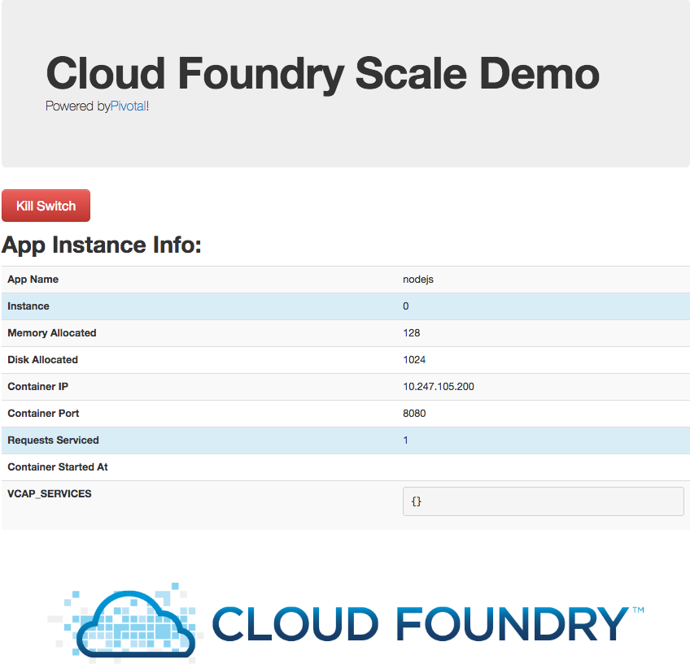

= Lab 1 - From Zero to Pushing Your First Application

== Target

. If you haven't already, download the latest release of the Cloud Foundry CLI from https://github.com/cloudfoundry/cli/releases for your operating system and install it.

. Set the API target for the CLI: (set appropriate end point for your environment)
+
----
$ cf api https://api.devcloudwest.inbcu.com --skip-ssl-validation
----

. Login to Pivotal Cloudfoundry:
+
----
$ cf login
----
+
Follow the prompts

== Push It!

. Change to the _nodejs-cf-sample-ap_ sample application directory:
+
----
$ cd $BOOTCAMP_HOME/nodejs-cf-sample-app
----

. Push the application!
+
----
$ cf push
----
+
You should see output similar to the following listing. Take a look at the listing callouts for a play-by-play of what's happening:
+
====
----
Pushing from manifest to org kwan / space development as qwan@pivotal.io...
Using manifest file /Users/qwan/workspace/git/BBB/PCF-Workshop-101-BBB/nodejs-cf-sample-app/manifest.yml
Getting app info...
Updating app with these attributes...
  name:                nodejs
  path:                /Users/qwan/workspace/git/BBB/PCF-Workshop-101-BBB/nodejs-cf-sample-app
  disk quota:          1G
  health check type:   port
  instances:           1
  memory:              128M
  stack:               cflinuxfs2
  routes:
    nodejs-responsible-okapi.cfapps.io

Updating app nodejs...
Mapping routes...
Comparing local files to remote cache...
Packaging files to upload...
Uploading files...
 101.83 KiB / 101.83 KiB [=================================================================================================================] 100.00% 1s

Waiting for API to complete processing files...

Staging app and tracing logs...
   Downloading binary_buildpack...
   Downloading staticfile_buildpack...
   Downloading java_buildpack...
   Downloading ruby_buildpack...
   Downloading dotnet_core_buildpack...
   Downloaded binary_buildpack
   Downloading nodejs_buildpack...
   Downloaded staticfile_buildpack
   Downloading go_buildpack...
   Downloaded dotnet_core_buildpack
   Downloading python_buildpack...
   Downloaded java_buildpack
   Downloading php_buildpack...
   Downloaded python_buildpack
   Downloading dotnet_core_buildpack_beta...
   Downloaded ruby_buildpack
   Downloading hwc_buildpack...
   Downloaded go_buildpack
   Downloaded php_buildpack
   Downloaded dotnet_core_buildpack_beta
   Downloaded hwc_buildpack
   Downloaded nodejs_buildpack
   Cell e10378db-4feb-437c-ac0b-c163fabbbbf1 creating container for instance 3d96f5ac-86f8-4f9e-8712-9803a13280f0
   Cell e10378db-4feb-437c-ac0b-c163fabbbbf1 successfully created container for instance 3d96f5ac-86f8-4f9e-8712-9803a13280f0
   Downloading app package...
   Downloaded app package (293K)
   -----> Nodejs Buildpack version 1.6.32
   -----> Installing binaries
          engines.node (package.json): 10.10.x
          engines.npm (package.json): unspecified (use default)
   -----> Installing node 10.10.0
          Copy [/tmp/buildpacks/2eecb65ead287c9aef814ca08d942207/dependencies/653e5cef05268f6fecf83d474d5a10e0/node-10.10.0-linux-x64-cflinuxfs2-9b4303cf.tgz]
          Using default npm version: 6.4.1
   -----> Installing yarn 1.9.4
          Copy [/tmp/buildpacks/2eecb65ead287c9aef814ca08d942207/dependencies/2d10153dc84bbc49dedac3162db062ff/yarn-v1.9.4-7667eb71.tar.gz]
          Installed yarn 1.9.4
   -----> Creating runtime environment
          PRO TIP: It is recommended to vendor the application's Node.js dependencies
          Visit http://docs.cloudfoundry.org/buildpacks/node/index.html#vendoring
          NODE_ENV=production
          NODE_HOME=/tmp/contents244512593/deps/0/node
          NODE_MODULES_CACHE=true
          NODE_VERBOSE=false
          NPM_CONFIG_LOGLEVEL=error
          NPM_CONFIG_PRODUCTION=true
   -----> Building dependencies
          Installing node modules (package.json)
   added 140 packages from 185 contributors and audited 1988 packages in 25.485s
   found 33 vulnerabilities (17 low, 3 moderate, 11 high, 2 critical)
     run `npm audit fix` to fix them, or `npm audit` for details
   Exit status 0
   Uploading droplet, build artifacts cache...
   Uploading droplet...
   Uploading build artifacts cache...
   Uploaded build artifacts cache (9.2M)
   Uploaded droplet (26.4M)
   Uploading complete
   Cell e10378db-4feb-437c-ac0b-c163fabbbbf1 stopping instance 3d96f5ac-86f8-4f9e-8712-9803a13280f0
   Cell e10378db-4feb-437c-ac0b-c163fabbbbf1 destroying container for instance 3d96f5ac-86f8-4f9e-8712-9803a13280f0

Waiting for app to start...

name:              nodejs
requested state:   started
instances:         1/1
usage:             128M x 1 instances
routes:            nodejs-responsible-okapi.cfapps.io
last uploaded:     Sat 06 Oct 17:46:52 EDT 2018
stack:             cflinuxfs2
buildpack:         nodejs
start command:     npm start

     state     since                  cpu    memory      disk      details
#0   running   2018-10-06T21:47:57Z   0.0%   0 of 128M   0 of 1G
----
<1> The CLI is using a manifest to provide necessary configuration details such as application name, memory to be allocated, and path to the application artifact.
Take a look at `manifest.yml` to see how.
<2> In most cases, the CLI indicates each Cloud Foundry API call as it happens.
In this case, the CLI has created an application record for _nodejs_ in your assigned space.
<3> All HTTP/HTTPS requests to applications will flow through Cloud Foundry's front-end router called http://docs.cloudfoundry.org/concepts/architecture/router.html[(Go)Router].
Here the CLI is creating a route with random word tokens inserted (again, see `manifest.yml` for a hint!) to prevent route collisions across the default domain.
<4> Now the CLI is _binding_ the created route to the application.
    Routes can actually be bound to multiple applications to support techniques such as https://docs.cloudfoundry.org/devguide/deploy-apps/blue-green.html[blue-green deployments].
<5> The CLI finally uploads the application bits to Pivotal Cloud Foundry.
<6> Node and NPM dependenices are pulled down.
<7> The complete package of your application and all of its necessary runtime components is called a _droplet_.
     Here the droplet is being uploaded to Pivotal Cloudfoundry's internal blobstore so that it can be easily downloaded to one or more Diego cells for execution.
<8> The CLI tells you exactly what command and argument set was used to start your application.
<9> Finally the CLI reports the current status of your application's health.
====

. Visit the application in your browser by hitting the route that was generated by the CLI:
+

== Interact with App from CF CLI

. Get information about the currently deployed application using CLI apps command:
+
----
$ cf apps
----
+
Note the application name for next steps

. Get information about running instances, memory, CPU, and other statistics using CLI instances command
+
----
$ cf app <<app_name>>
----

. Stop the deployed application using the CLI
+
----
$ cf stop <<app_name>>
----

. Delete the deployed application using the CLI
+
----
$ cf delete <<app_name>>
----
