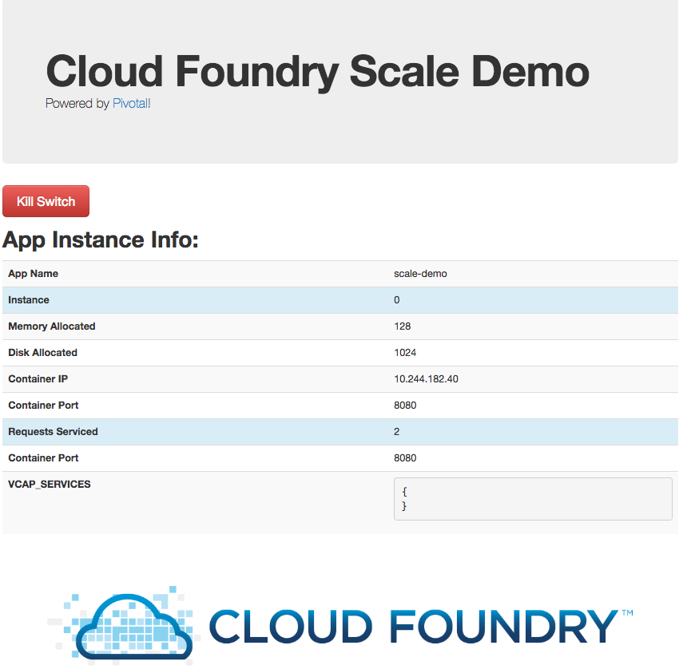

= Lab 1 - From Zero to Pushing Your First Application

== Target

. If you haven't already, download the latest release of the Cloud Foundry CLI from https://github.com/cloudfoundry/cli/releases for your operating system and install it.

. Set the API target for the CLI: (set appropriate end point for your environment)
+
----
$ cf api https://api.sys.gn01.pcf.dcsg.com --skip-ssl-validation
----

. Login to Pivotal Cloudfoundry:
+
----
$ cf login
----
+
Follow the prompts

== Push It!

. Change to the _pcf-autoscale_ sample application directory:
+
----
$ cd $BOOTCAMP_HOME/pcf-autoscale
----

. Push the application!
+
----
$ cf push
----
+
You should see output similar to the following listing. Take a look at the listing callouts for a play-by-play of what's happening:
+
====
----
Using manifest file /Users/qwan/workspace/git/BBB/PCF-Workshop-101-BBB/pcf-autoscale/manifest.yml
Getting app info...
Creating app with these attributes...
+ name:        scale-demo
  path:        /Users/qwan/workspace/git/BBB/PCF-Workshop-101-BBB/pcf-autoscale
+ instances:   1
+ memory:      128M
  routes:
+   scale-demo-lean-topi.cfapps.io

Creating app scale-demo...
Mapping routes...
Comparing local files to remote cache...
Packaging files to upload...
Uploading files...
 134.45 KiB / 134.45 KiB [=================================================================================================================] 100.00% 1s

Waiting for API to complete processing files...

Staging app and tracing logs...
   Downloading binary_buildpack...
   Downloading ruby_buildpack...
   Downloading nodejs_buildpack...
   Downloading java_buildpack...
   Downloading staticfile_buildpack...
   Downloaded java_buildpack
   Downloading dotnet_core_buildpack...
   Downloaded staticfile_buildpack
   Downloading php_buildpack...
   Downloaded ruby_buildpack
   Downloading go_buildpack...
   Downloaded binary_buildpack
   Downloading python_buildpack...
   Downloaded nodejs_buildpack
   Downloading hwc_buildpack...
   Downloaded dotnet_core_buildpack
   Downloading dotnet_core_buildpack_beta...
   Downloaded php_buildpack
   Downloaded python_buildpack
   Downloaded go_buildpack
   Downloaded hwc_buildpack
   Downloaded dotnet_core_buildpack_beta
   Cell e222f891-b602-4a15-9b26-fd45771f60ad creating container for instance 9f71389f-295c-41ff-8170-67ab7b41efeb
   Cell e222f891-b602-4a15-9b26-fd45771f60ad successfully created container for instance 9f71389f-295c-41ff-8170-67ab7b41efeb
   Downloading app package...
   Downloaded app package (2.7M)
   -----> Ruby Buildpack version 1.7.23
   -----> Supplying Ruby
   -----> Installing bundler 1.16.4
          Copy [/tmp/buildpacks/0c91b4289bacb70ecdfc55089e7cfb1c/dependencies/ba2821c0e38e6035435fe6948efe4abe/bundler-1.16.4-any-stack-7f919b43.tgz]
          **WARNING** You have not declared a Ruby version in your Gemfile.
          Defaulting to 2.4.4
          See http://docs.cloudfoundry.org/buildpacks/ruby/index.html#runtime for more information.
   -----> Installing ruby 2.4.4
          Copy [/tmp/buildpacks/0c91b4289bacb70ecdfc55089e7cfb1c/dependencies/470826c490d9fa03131e5e98c93277c0/ruby-2.4.4-linux-x64-cflinuxfs2-65674838.tgz]
   -----> Update rubygems from 2.6.14.1 to 2.7.7
   -----> Installing rubygems 2.7.7
          Copy [/tmp/buildpacks/0c91b4289bacb70ecdfc55089e7cfb1c/dependencies/1f9ecc907095d15df816f3815fcd3cf3/rubygems-2.7.7-4cb2c9a3.tgz]
          **WARNING** You have the `.bundle/config` file checked into your repository
          It contains local state like the location of the installed bundle
          as well as configured git local gems, and other settings that should
          not be shared between multiple checkouts of a single repo. Please
          remove the `.bundle/` folder from your repo and add it to your `.gitignore` file.
   -----> Installing dependencies using bundler 1.16.4
          Running: bundle install --without development:test --jobs=4 --retry=4 --path /tmp/contents180782171/deps/0/vendor_bundle --binstubs /tmp/contents180782171/deps/0/binstubs --deployment
          Using bundler 1.16.4
          Installing rack 1.5.1
          Installing tilt 1.3.3
          Installing rack-protection 1.3.2
          Installing sinatra 1.3.4
          Bundle complete! 1 Gemfile dependency, 5 gems now installed.
          Gems in the groups development and test were not installed.
          Bundled gems are installed into `/tmp/contents180782171/deps/0/vendor_bundle`
   -----> Regenerating bundler binstubs...
          Cleaning up the bundler cache.
   -----> Creating runtime environment
   -----> Saving vendor_bundle to cache
   -----> Finalizing Ruby
   -----> Copy binaries to app/bin directory
   Exit status 0
   Uploading droplet, build artifacts cache...
   Uploading droplet...
   Uploading build artifacts cache...
   Uploaded build artifacts cache (1.1M)
   Uploaded droplet (22.7M)
   Uploading complete
   Cell e222f891-b602-4a15-9b26-fd45771f60ad stopping instance 9f71389f-295c-41ff-8170-67ab7b41efeb
   Cell e222f891-b602-4a15-9b26-fd45771f60ad destroying container for instance 9f71389f-295c-41ff-8170-67ab7b41efeb
   Cell e222f891-b602-4a15-9b26-fd45771f60ad successfully destroyed container for instance 9f71389f-295c-41ff-8170-67ab7b41efeb

Waiting for app to start...

name:              scale-demo
requested state:   started
instances:         1/1
usage:             128M x 1 instances
routes:            scale-demo-lean-topi.cfapps.io
last uploaded:     Sat 06 Oct 17:11:07 EDT 2018
stack:             cflinuxfs2
buildpack:         ruby
start command:     bundle exec rackup config.ru -p $PORT

     state     since                  cpu    memory      disk      details
#0   running   2018-10-06T21:11:43Z   0.0%   0 of 128M   0 of 1G
----
<1> The CLI is using a manifest to provide necessary configuration details such as application name, memory to be allocated, and path to the application artifact.
Take a look at `manifest.yml` to see how.
<2> In most cases, the CLI indicates each Cloud Foundry API call as it happens.
In this case, the CLI has created an application record for _Workshop_ in your assigned space.
<3> All HTTP/HTTPS requests to applications will flow through Cloud Foundry's front-end router called http://docs.cloudfoundry.org/concepts/architecture/router.html[(Go)Router].
Here the CLI is creating a route with random word tokens inserted (again, see `manifest.yml` for a hint!) to prevent route collisions across the default domain.
<4> Now the CLI is _binding_ the created route to the application.
Routes can actually be bound to multiple applications to support techniques such as https://docs.cloudfoundry.org/devguide/deploy-apps/blue-green.html[blue-green deployments].
<5> The CLI finally uploads the application bits to Pivotal Cloudfoundry.
<6> Now we begin the staging process. The https://github.com/cloudfoundry/ruby-buildpack[Ruby Buildpack] is detected and responsible for assembling the runtime components necessary to run the application.
<7> Here we see the version of the Ruby that has been chosen and installed.
<8> The complete package of your application and all of its necessary runtime components is called a _droplet_.
Here the droplet is being uploaded to Pivotal Cloudfoundry's internal blobstore so that it can be easily downloaded to one or more Diego cells for execution.
<9> The CLI tells you exactly what command and argument set was used to start your application.
<10> Finally the CLI reports the current status of your application's health.
====

. Visit the application in your browser by hitting the route that was generated by the CLI:
+

== Interact with App from CF CLI

. Get information about the currently deployed application using CLI apps command:
+
----
$ cf apps
----
+
Note the application name for next steps

. Get information about running instances, memory, CPU, and other statistics using CLI instances command
+
----
$ cf app <<app_name>>
----

. Stop the deployed application using the CLI
+
----
$ cf stop <<app_name>>
----

. Delete the deployed application using the CLI
+
----
$ cf delete <<app_name>>
----
