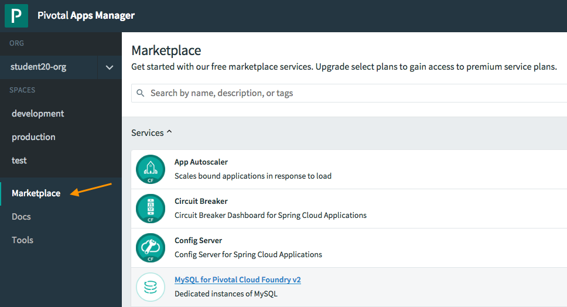
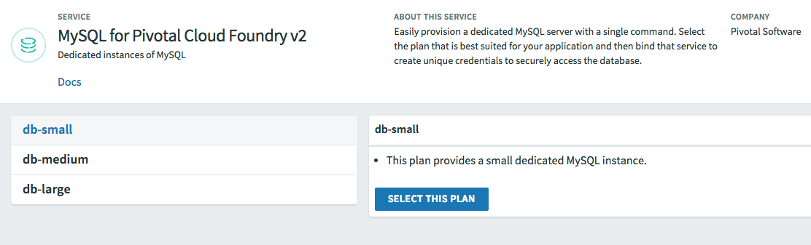
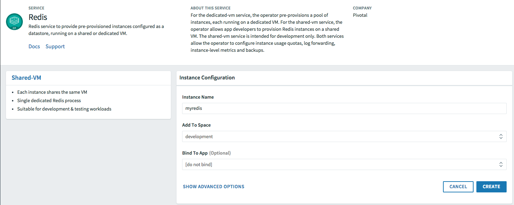
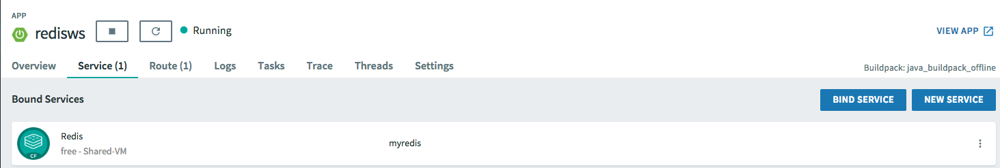

= Lab 2 - Binding to Cloudfoundry Services

[abstract]
--
The _Workshop_ application was designed to illustrate the ease with which data services can be bound to and utilized by applications running on Cloud Foundry.
In this lab, we'll be binding the application to a Redis service.

Cloud Foundry services are managed through two primary types of operations:

Create/Delete:: These operations create or delete instances of a service.
For a database this could mean creating/deleting a schema in an existing multitenant cluster or creating/deleting a dedicated database cluster.
Bind/Unbind:: These operations create or delete unique credential sets for an existing service instance that can then be injected into the environment of an application instance.
--

//== A Bit of Review
//
//We will use a separate spring boot application which requires Redis server. Make sure to change to the _cf-spring-boot-redis_ sample application directory.  For this lab we will be using the Java application.  Deploy the application:
//
//----
//$ cf push
//----
//
//After the application deploys and starts, visit the application in your browser by hitting the route that was generated by the CLI.  Currently, this data is being retrieved from an in-memory HSQL database running within the JVM.  Let's change that.
//
//image::lab.png[]

== The Services Marketplace

There are two ways to discover what services are available on Pivotal Cloudfoundry.
The first is available on any instance of Cloud Foundry: the CLI. Just type:

----
$ cf marketplace
----

and you'll get a list of services, their available plans, and descriptions. On Pivotal Cloudfoundry, the ``free'' tier of plans is normally the first one listed.

The second way is specific to Pivotal Cloudfoundry's Apps Manager UI.
If you haven't already, login to it by visiting https://apps.run.haas-123.pez.pivotal.io/

Click on the ''Marketplace'' link:

and you'll see the same service/plan/description listing in the browser:

== Creating and Binding to a Service Instance

. Let's begin by creating a Redis service instance.
From the Apps Manager UI service marketplace, select _Redis_, select the *Shared-VM plan*, and provide an instance name as "myredis" as specified in manifest.
Select your workshop application in the "bind" dropdown to bind this service into your spring boot application.
+

. Now let's _restart_ the application.  Since each container is immutable in order to introduce a service it must be restarted.
+
----
$ cf restart
----

. Once the application is running, visit the app route URL.  You'll notice now we have information that could be used to connect to a DB.
In fact, our data is now being retrieved from that Redis!
+

----
The bound services are {"p-redis":[{ "name": "myredis", "instance_name": "myredis", "binding_name": null, "credentials": { "host": "10.195.4.12", "password": "ec669a32-9aa3-4331-8223-0979d8615c9e", "port": 38618 }, "syslog_drain_url": null, "volume_mounts": [ ], "label": "p-redis", "provider": null, "plan": "shared-vm", "tags": [ "pivotal", "redis" ] }]}
----

. You may also verify your service was provisioned in the Apps Manager UI by clicking on your application and selecting the _Services_ tab.
+

+
You should now see the service created in step 2 listed.

. You may also verify your service was provisioned using the CLI:
+
----
$ cf services
----
+
You should now see the service created in step 2 listed and your application listed as a bound app.
