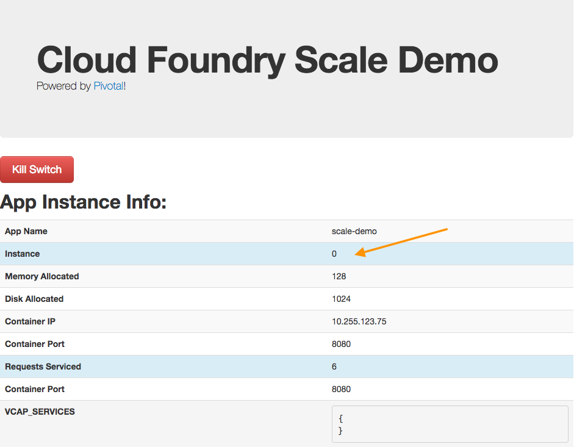

= Lab 3 - Operating your Application

[abstract]
--
Pivotal Cloudfoundry makes the work of performing operations actions, such as scaling, doing a zero-downtime deploy, and managing application health very easy.
In the next two labs we'll explore Pivotal Cloudfoundry operations.
--

== Scale the Application Up

. Now let's increase the number of running application instances to 3.  For this lab you can use the Java, Ruby, or Node.js sample app.  In each of the commands below replace _workshop_ with the name of your deployed application:
+
----
$ cf scale scale-demo -i 2
Scaling app scale-demo in org student20-org / space development as student20...
OK
----
+
In reporting `OK`, the CLI is letting you know that the additional requested instances have been started, but they are not yet necessarily running.

. We can determine how many instances are actually running like this:
+
====
----
$ cf app scale-demo
Showing health and status for app scale-demo in org student20-org / space development as student20...

name:              scale-demo
requested state:   started
instances:         2/2
usage:             128M x 2 instances
routes:            scale-demo-wacky-chipmunk.cfapps.haas-123.pez.pivotal.io
last uploaded:     Mon 08 Oct 10:35:30 EDT 2018
stack:             cflinuxfs2
buildpack:         ruby

     state     since                  cpu    memory          disk          details
#0   running   2018-10-08T14:36:09Z   0.0%   24.5M of 128M   94.3M of 1G    <1>
#1   starting   2018-10-08T22:25:19Z   0.0%   19.5M of 128M   94.3M of 1G    <2>
----
<1> This application instance has completed the startup process and is actually able to accept requests.
<2> This application instance is still starting and will not have any requests routed to it.
====

. Eventually all instances will converge to a running state:
+
----
$ cf app scale-demo
Showing health and status for app scale-demo in org student20-org / space development as student20...

name:              scale-demo
requested state:   started
instances:         2/2
usage:             128M x 2 instances
routes:            scale-demo-wacky-chipmunk.cfapps.haas-123.pez.pivotal.io
last uploaded:     Mon 08 Oct 10:35:30 EDT 2018
stack:             cflinuxfs2
buildpack:         ruby

     state     since                  cpu    memory          disk          details
#0   running   2018-10-08T14:36:09Z   0.0%   24.5M of 128M   94.3M of 1G
#1   running   2018-10-08T22:25:19Z   0.0%   19.5M of 128M   94.3M of 1G
----

. Revisit the application route in the browser.
Refresh several times.
You should observe the instance index changing as you do so:
+
image::lab.png[]
+
The aforementioned http://docs.cloudfoundry.org/concepts/architecture/router.html[(Go)Router] is applying a round-robin routing algorithm to all of the application instances assigned to this route.
As an instance reaches the `running` state, it'll be registed to the routing table assigned to its route by sending a message to Cloud Foundry's message bus.
All (Go)Router instances are subscribed to this channel and register the routes independently.
This makes for very dynamic and rapid reconfiguration!

== Scale the Application Down

. We can scale the application instances back down as easily as we scaled them up, using the same command structure:
+
----
$ cf scale scale-demo -i 1
Scaling app scale-demo in org student20-org / space development as student20...
OK
----

. Check the application status again:
+
----
$ cf app scale-demo
Showing health and status for app scale-demo in org student20-org / space development as student20...

name:              scale-demo
requested state:   started
instances:         1/1
usage:             128M x 1 instances
routes:            scale-demo-wacky-chipmunk.cfapps.haas-123.pez.pivotal.io
last uploaded:     Mon 08 Oct 10:35:30 EDT 2018
stack:             cflinuxfs2
buildpack:         ruby

     state     since                  cpu    memory          disk          details
#0   running   2018-10-08T14:36:09Z   0.0%   25.3M of 128M   94.3M of 1G
----
+
As you can see, we're back down to only one instance running, and it is in fact the original index 0 that we started with.

. Confirm that by again revisiting the route in the browser and checking the instance index:
+

== HTTP Routing

There are two ways to discover what routes, or HTTP URLs, are mapped to an application
The first is available via the CLI. Just type:

----
$ cf app workshop
Showing health and status for app workshop in org pivot-ksrinivasarao / space development as ksrinivasarao@pivotal.io...

name:                workshop
requested state:     started
instances:           1/1
isolation segment:   main
usage:               768M x 1 instances
routes:              workshop-anxious-fox.pcfbeta.io
last uploaded:       Mon 09 Jul 10:26:35 EDT 2018
stack:               cflinuxfs2
buildpack:           client-certificate-mapper=1.6.0_RELEASE container-security-provider=1.13.0_RELEASE
                     java-buildpack=v4.12-offline-https://github.com/cloudfoundry/java-buildpack.git#5dca820 java-main java-opts
                     java-security jvmkill-agent=1.12.0_RELEASE open-jdk-...

     state     since                  cpu    memory           disk           details
#0   running   2018-07-09T15:49:00Z   0.5%   284.3M of 768M   154.3M of 1G
----

and you'll see the list of routes in the section that says _routes_.

The second way is via the Apps Manager UI.  Click on the _Workshop_ application to view application details.  Select the _Routes_ tab to view a list of mapped routes:

image::lab2.png[]

. We can easily add an additional route by clicking on _MAP A ROUTE_ and supplying the new hostname:
+
image::lab3.png[]

. Navigate to the new URL in your browser window.  You should see that same application displayed!
+
image::lab4.png[]

. We can just as easily remove a route by clicking on _Unmap (X icon)_ on the route you wish to remove.
+
image::lab5.png[]
+
If you navigate to that URL you'll receive a HTTP 404 response
+
image::lab6.png[]

. This is how blue-green deployments are accomplished.
+
image::blue-green.png[]

== Accessing Container Contents

SSH into your app container via 'cf ssh APP_NAME'

Reference: https://docs.pivotal.io/pivotalcf/customizing/diego-ssh/access-apps.html
