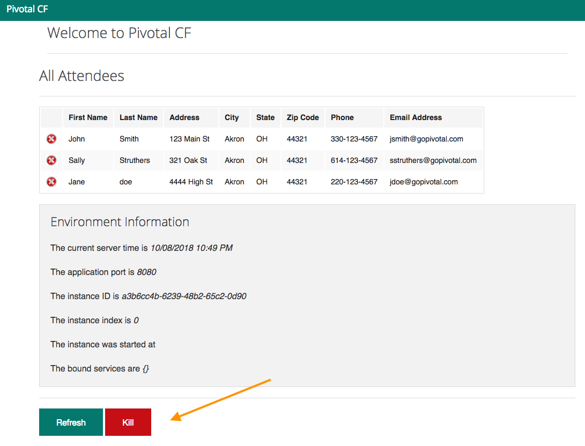
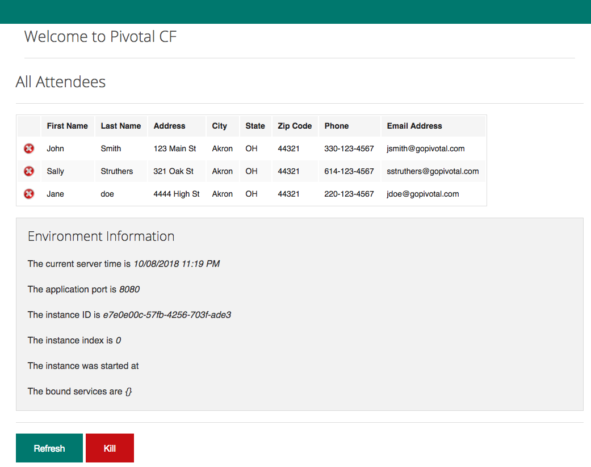

= Lab 4 - Monitoring your Application

[abstract]
--
Pivotal Cloudfoundry makes the work of performing operations actions, such as scaling, doing a zero-downtime deploy, and managing application health very easy.
In the this labs we'll continue to explore Pivotal Cloudfoundry application operations.
--

== Tailing Application Logs

One of the most important enablers of visibility into application behavior is logging.
Effective management of logs has historically been very difficult.
Cloud Foundry's https://github.com/cloudfoundry/loggregator[log aggregation] components simplify log management by assuming responsibility for it.
Application developers need only log all messages to either `STDOUT` or `STDERR`, and the platform will capture these messages.

=== For Developers

Application developers can view application logs using the CF CLI.

. Let's view recent log messages for the application.  For this lab you can use the Java, Ruby, or Node.js sample app.  In each of the commands below replace _workshop_ with the name of your deployed application:
+
----
$ cf logs workshop --recent
----
+
Here are two interesting subsets of one output from that command:
+
.CF Component Logs
====
----
2018-10-08T18:49:35.68-0400 [RTR/0] OUT workshop-anxious-gazelle.cfapps.haas-123.pez.pivotal.io - [2018-10-08T22:49:35.657+0000] "GET / HTTP/1.1" 200 0 4567 "-" "Mozilla/5.0 (Macintosh; Intel Mac OS X 10_13_3) AppleWebKit/537.36 (KHTML, like Gecko) Chrome/68.0.3440.106 Safari/537.36" "10.193.195.1:13656" "10.193.195.78:61002" x_forwarded_for:"173.54.17.140, 10.193.195.1" x_forwarded_proto:"https" vcap_request_id:"7513f296-f545-4e80-6ebe-b90cfef53122" response_time:0.029399449 app_id:"b9a722f3-00f4-4cee-b887-ab49f8cce925" app_index:"0" x_b3_traceid:"327d4b220c98e362" x_b3_spanid:"327d4b220c98e362" x_b3_parentspanid:"-"

2018-10-08T18:49:35.71-0400 [APP/PROC/WEB/1] OUT 2018-10-08 22:49:35.715  INFO 18 --- [           main] o.hibernate.annotations.common.Version   : HCANN000001: Hibernate Commons Annotations {5.0.1.Final}2015-02-13T15:04:33.51-0600 [DEA/12]     OUT Starting app instance (index 2) with guid 7a428901-1691-4cce-b7f6-62d186c5cb55 <3>

2018-10-08T18:49:42.15-0400 [CELL/1] OUT Container became healthy
----
<1> An ``Apache-style'' access log event from the (Go)Router
<2> An API log event that corresponds to an event as shown in `cf events`
<3> A Cell log event indicating the state of an container.
====
+
.Application Logs
====
----
2018-10-08T18:49:40.98-0400 [APP/PROC/WEB/1] OUT 2018-10-08 22:49:40.982  INFO 18 --- [           main] o.s.j.e.a.AnnotationMBeanExporter        : Registering beans for JMX exposure on startup
   2018-10-08T18:49:40.98-0400 [APP/PROC/WEB/1] OUT 2018-10-08 22:49:40.985  INFO 18 --- [           main] o.s.j.e.a.AnnotationMBeanExporter        : Bean with name 'dataSource' has been autodetected for JMX exposure
   2018-10-08T18:49:40.99-0400 [APP/PROC/WEB/1] OUT 2018-10-08 22:49:40.995  INFO 18 --- [           main] o.s.j.e.a.AnnotationMBeanExporter        : Located MBean 'dataSource': registering with JMX server as MBean [com.zaxxer.hikari:name=dataSource,type=HikariDataSource]
   2018-10-08T18:49:41.07-0400 [APP/PROC/WEB/1] OUT 2018-10-08 22:49:41.075  INFO 18 --- [           main] o.s.b.w.embedded.tomcat.TomcatWebServer  : Tomcat started on port(s): 8080 (http) with context path ''
   2018-10-08T18:49:41.08-0400 [APP/PROC/WEB/1] OUT 2018-10-08 22:49:41.084  INFO 18 --- [           main] io.pivotal.workshop.WorkshopApplication  : Started WorkshopApplication in 13.437 seconds (JVM running for 15.126)
----
====
+
As you can see, Cloud Foundry's log aggregation components capture both application logs and CF component logs relevant to your application.
These events are properly interleaved based on time, giving you an accurate picture of events as they transpired across the system.

. To get a running ``tail'' of the application logs rather than a dump, simply type:
+
----
$ cf logs workshop
----
+
You can try various things like refreshing the browser and triggering stop/start events to see logs being generated.

== Health Management

Cloud Foundry's https://docs.cloudfoundry.org/concepts/architecture/#nsync-bbs[nsync, BBS, and Cell Rep components] actively monitors the health of our application processes and will restart them should they crash.

. If you don't have one already running, start a log tail for `workshop`.
+
----
$ cf logs workshop
----

. If you do not have more than one application instance running, execute the scale command to scale to 2 or more application instances.  Visit the application in the browser, and click on the ``Kill'' button. This button will trigger a JVM exit with an error code (`System.exit(1)`), causing the CF components to observe an application instance crash:
+

. After clicking the kill switch a couple of interesting things should happen.
First, you'll see an error code returned in the browser, as the request you submitted never returns a response:
+
image::lab1.png[]
+
Also, if you're paying attention to the log tail, you'll see some interesting log messages fly by:
+
====
----
   2018-10-08T19:10:32.86-0400 [APP/PROC/WEB/0] OUT 2018-10-08 23:10:32.866  WARN 14 --- [nio-8080-exec-9] i.p.w.w.CloudFoundryWorkshopController   : *** The system is shutting down. ***
   2018-10-08T19:10:32.87-0400 [APP/PROC/WEB/0] OUT 2018-10-08 23:10:32.870  INFO 14 --- [       Thread-5] ConfigServletWebServerApplicationContext : Closing org.springframework.boot.web.servlet.context.AnnotationConfigServletWebServerApplicationContext@161cd475: startup date [Mon Oct 08 23:05:05 UTC 2018]; root of context hierarchy
   2018-10-08T19:10:32.87-0400 [APP/PROC/WEB/0] OUT 2018-10-08 23:10:32.878  INFO 14 --- [       Thread-5] o.s.j.e.a.AnnotationMBeanExporter        : Unregistering JMX-exposed beans on shutdown
   2018-10-08T19:10:32.88-0400 [APP/PROC/WEB/0] OUT 2018-10-08 23:10:32.880  INFO 14 --- [       Thread-5] o.s.j.e.a.AnnotationMBeanExporter        : Unregistering JMX-exposed beans
   2018-10-08T19:10:32.88-0400 [APP/PROC/WEB/0] OUT 2018-10-08 23:10:32.884  INFO 14 --- [       Thread-5] j.LocalContainerEntityManagerFactoryBean : Closing JPA EntityManagerFactory for persistence unit 'default'
   2018-10-08T19:10:32.88-0400 [APP/PROC/WEB/0] OUT 2018-10-08 23:10:32.885  INFO 14 --- [       Thread-5] .SchemaDropperImpl$DelayedDropActionImpl : HHH000477: Starting delayed drop of schema as part of SessionFactory shut-down'
   2018-10-08T19:10:32.90-0400 [APP/PROC/WEB/0] OUT 2018-10-08 23:10:32.902  INFO 14 --- [       Thread-5] com.zaxxer.hikari.HikariDataSource       : HikariPool-1 - Shutdown initiated...
   2018-10-08T19:10:32.92-0400 [APP/PROC/WEB/0] OUT 2018-10-08 23:10:32.922  INFO 14 --- [       Thread-5] com.zaxxer.hikari.HikariDataSource       : HikariPool-1 - Shutdown completed.
   2018-10-08T19:10:40.18-0400 [RTR/1] OUT workshop-anxious-gazelle.cfapps.haas-123.pez.pivotal.io - [2018-10-08T23:10:32.848+0000] "GET /kill HTTP/1.1" 502 0 67 "https://workshop-anxious-gazelle.cfapps.haas-123.pez.pivotal.io/" "Mozilla/5.0 (Macintosh; Intel Mac OS X 10_13_3) AppleWebKit/537.36 (KHTML, like Gecko) Chrome/68.0.3440.106 Safari/537.36" "10.193.195.1:24583" "10.193.195.79:61004" x_forwarded_for:"173.54.17.140, 10.193.195.1" x_forwarded_proto:"https" vcap_request_id:"0865209a-c76b-4e37-7224-2d1611cb972e" response_time:7.332912622 app_id:"b9a722f3-00f4-4cee-b887-ab49f8cce925" app_index:"0" x_b3_traceid:"f05d7430f993393a" x_b3_spanid:"f05d7430f993393a" x_b3_parentspanid:"-"
   2018-10-08T19:10:40.18-0400 [RTR/1] OUT
   2018-10-08T19:10:40.55-0400 [APP/PROC/WEB/0] OUT Exit status 255
   2018-10-08T19:10:40.56-0400 [CELL/SSHD/0] OUT Exit status 0
   2018-10-08T19:10:40.74-0400 [API/0] OUT Process has crashed with type: "web"
   2018-10-08T19:10:40.77-0400 [API/0] OUT App instance exited with guid b9a722f3-00f4-4cee-b887-ab49f8cce925 payload: {"instance"=>"9955a131-a245-4840-4f3f-9f94", "index"=>0, "reason"=>"CRASHED", "exit_description"=>"APP/PROC/WEB: Exited with status 255", "crash_count"=>1, "crash_timestamp"=>1539040240684955096, "version"=>"2795090e-81a9-4d10-ac12-2f47df4eebc5"}
   2018-10-08T19:10:40.75-0400 [CELL/0] OUT Cell aea1c927-4993-41a1-8302-d3b286603f51 stopping instance 9955a131-a245-4840-4f3f-9f94
   2018-10-08T19:10:40.75-0400 [CELL/0] OUT Cell aea1c927-4993-41a1-8302-d3b286603f51 destroying container for instance 9955a131-a245-4840-4f3f-9f94
  ----
<1> Just before issuing the `System.exit(1)` call, the application logs that the kill switch was clicked.
<2> The (Go)Router logs the error.
<3> The API logs that an application instance exited due to a crash.
====

. Wait a few seconds...  By this time you should have noticed some additional interesting events in the logs:
+
====
----
2018-10-08T19:10:40.87-0400 [CELL/0] OUT Cell c5c13390-9d18-41a0-8a8a-1098edbd2250 creating container for instance e7e0e00c-57fb-4256-703f-ade3
   2018-10-08T19:10:41.25-0400 [CELL/0] OUT Cell aea1c927-4993-41a1-8302-d3b286603f51 successfully destroyed container for instance 9955a131-a245-4840-4f3f-9f94
   2018-10-08T19:10:41.37-0400 [CELL/0] OUT Cell c5c13390-9d18-41a0-8a8a-1098edbd2250 successfully created container for instance e7e0e00c-57fb-4256-703f-ade3
   2018-10-08T19:10:42.55-0400 [CELL/0] OUT Starting health monitoring of container
   2018-10-08T19:10:42.71-0400 [APP/PROC/WEB/0] OUT JVM Memory Configuration: -Xmx157226K -Xss1M -XX:ReservedCodeCacheSize=240M -XX:MaxDirectMemorySize=10M -XX:MaxMetaspaceSize=117205K
----
<1> The Cell indicates that it is starting another instance of the application (since Health monitoring observing a difference between the desired and actual state).
<2> The new application instance starts logging events as it starts up.
====

. Revisiting the *HOME PAGE* of the application (don't simply refresh the browser as you're still on the `/killSwitch` endpoint and you'll just kill the application again!) and you should see a fresh instance started:
+

== Viewing Application _Events_

Cloud Foundry only allows application configuration to be modified via its API.
This gives application operators confidence that all changes to application configuration are known and auditable.
It also reduces the number of causes that must be considered when problems arise.

All application configuration changes are recorded as _events_.
These events can be viewed via the Cloud Foundry API, and viewing is facilitated via the CLI.

Take a look at the events that have transpired so far for our deployment of `workshop`:

====
----
$ cf events workshop
Getting events for app workshop in org student20-org / space development as student20...

time                          event                      actor       description
2018-10-08T19:10:40.00-0400   app.crash                  workshop    index: 0, reason: CRASHED, exit_description: APP/PROC/WEB: Exited with status 255
2018-10-08T19:10:40.00-0400   audit.app.process.crash    web         index: 0, reason: CRASHED, exit_description: APP/PROC/WEB: Exited with status 255
2018-10-08T19:09:42.00-0400   audit.app.process.scale    student20   instances: 1
2018-10-08T19:05:03.00-0400   app.crash                  workshop    index: 1, reason: CRASHED, exit_description: APP/PROC/WEB: Exited with status 255
2018-10-08T19:05:03.00-0400   audit.app.process.crash    web         index: 1, reason: CRASHED, exit_description: APP/PROC/WEB: Exited with status 255
2018-10-08T19:04:56.00-0400   app.crash                  workshop    index: 0, reason: CRASHED, exit_description: APP/PROC/WEB: Exited with status 255
2018-10-08T19:04:56.00-0400   audit.app.process.crash    web         index: 0, reason: CRASHED, exit_description: APP/PROC/WEB: Exited with status 255
2018-10-08T18:49:20.00-0400   audit.app.process.scale    student20   instances: 2
2018-10-08T17:51:26.00-0400   audit.app.droplet.create   student20
2018-10-08T17:50:52.00-0400   audit.app.update           student20   state: STARTED
2018-10-08T17:50:51.00-0400   audit.app.build.create     student20
2018-10-08T17:50:44.00-0400   audit.app.upload-bits      student20
2018-10-08T17:50:43.00-0400   audit.app.map-route        student20
2018-10-08T17:50:43.00-0400   audit.app.create           student20   instances: 1, memory: 768, state: STOPPED, environment_json: PRIVATE DATA HIDDEN
----
* Events are sorted newest to oldest.
====

. Let's explicitly ask for the application to be stopped:
+
----
$ cf stop workshop
Stopping app workshop in org student20-org / space development as student20...
OK
----

. Now, examine the additional `audit.app.update` event:
+
----
$ cf events workshop
Getting events for app workshop in org student20-org / space development as student20...

time                          event                      actor       description
2018-10-08T19:37:11.00-0400   audit.app.update           student20   state: STOPPED
----

. Start the application again:
+
----
$ cf start workshop
Starting app workshop in org student20-org / space development as student20...

Waiting for app to start...

name:              workshop
requested state:   started
instances:         1/1
usage:             768M x 1 instances
routes:            workshop-anxious-gazelle.cfapps.haas-123.pez.pivotal.io
last uploaded:     Mon 08 Oct 17:50:44 EDT 2018
stack:             cflinuxfs2
buildpack:         client-certificate-mapper=1.6.0_RELEASE container-security-provider=1.14.0_RELEASE
                   java-buildpack=v4.13.1-offline-https://github.com/cloudfoundry/java-buildpack.git#4644847 java-main java-opts java-security
                   jvmkill-agent=1.16.0_RELEASE open-jd...
start command:     JAVA_OPTS="-agentpath:$PWD/.java-buildpack/open_jdk_jre/bin/jvmkill-1.16.0_RELEASE=printHeapHistogram=1 -Djava.io.tmpdir=$TMPDIR
                   -Djava.ext.dirs=$PWD/.java-buildpack/container_security_provider:$PWD/.java-buildpack/open_jdk_jre/lib/ext
                   -Djava.security.properties=$PWD/.java-buildpack/java_security/java.security $JAVA_OPTS" &&
                   CALCULATED_MEMORY=$($PWD/.java-buildpack/open_jdk_jre/bin/java-buildpack-memory-calculator-3.13.0_RELEASE -totMemory=$MEMORY_LIMIT
                   -loadedClasses=18279 -poolType=metaspace -stackThreads=250 -vmOptions="$JAVA_OPTS") && echo JVM Memory Configuration:
                   $CALCULATED_MEMORY && JAVA_OPTS="$JAVA_OPTS $CALCULATED_MEMORY" && MALLOC_ARENA_MAX=2 SERVER_PORT=$PORT eval exec
                   $PWD/.java-buildpack/open_jdk_jre/bin/java $JAVA_OPTS -cp $PWD/. org.springframework.boot.loader.JarLauncher

     state     since                  cpu      memory           disk           details
#0   running   2018-10-08T23:38:15Z   233.4%   284.6M of 768M   161.2M of 1G
----

. And again, view the additional `audit.app.update` event:
+
----
$ cf events workshop
Getting events for app workshop in org student20-org / space development as student20...

time                          event                      actor       description
2018-10-08T19:37:50.00-0400   audit.app.update           student20   state: STARTED
----
