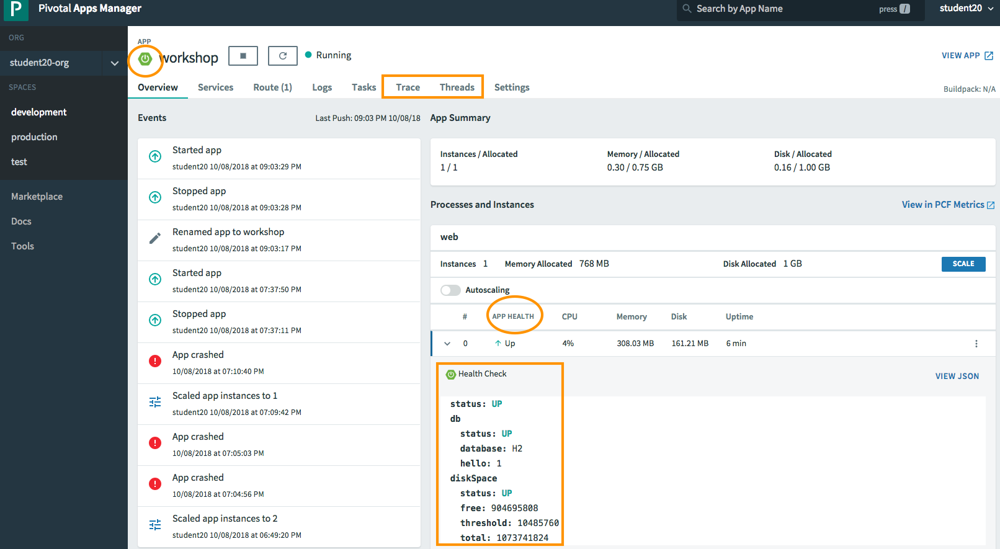
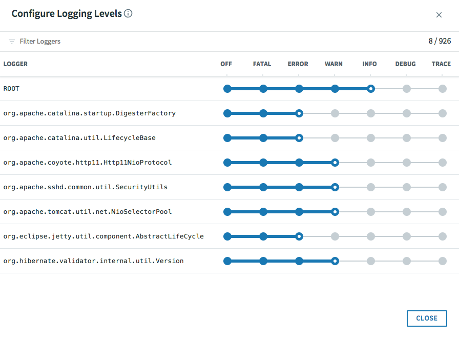
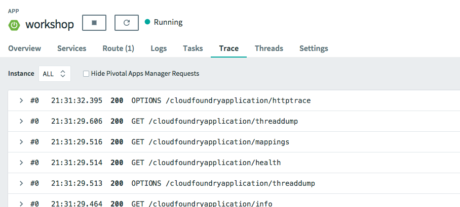
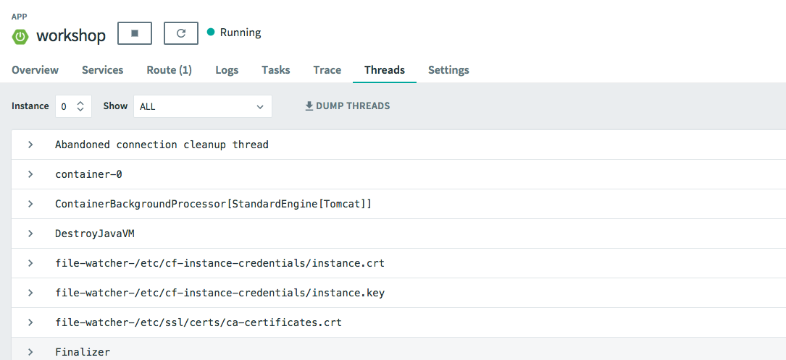
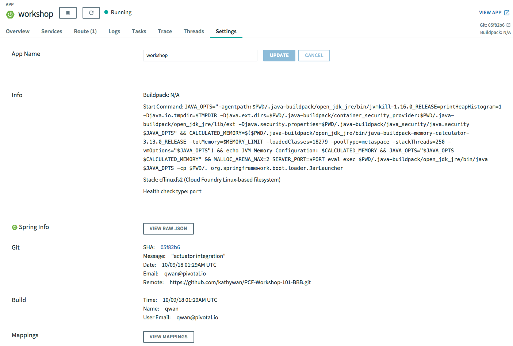

= Lab 5 - Spring Boot Actuator with PCF

[abstract]
--
Adding Actuator to your Spring Boot application deployed on PCF gets you the following production-ready features:

* Health Check column & expanded information in Instances section
* git commit id indicator, navigable to your git repo
* Summary git info under Settings tab (also navigable to repo)
* Runtime adjustment of logging levels, exposed via Actuator endpoints
* Heap Dump
* View Trace
* View Threads, dump/download for further analysis
--

== Apps Manager integration with Actuator

.Adding actuator to your spring boot application give you extra visual views for your app:
* a visual indicator (icon) indicating your application is Spring Boot Actuator-enabled.
* an App Health column in the Instances section with a top-level indication of your application's state, along with detailed information you can see by expanding an instance.

* From your application's Logs tab, you can review logs and configure logging levels dynamically, with zero downtime.

* View Trace

* View Threads and dump

* By add a bit application configuration, we can expose Git information through the Actuator /info endpoint and exposed in appsManager Settings tab

== Monitoring Spring Boot Applications
custom metrics
